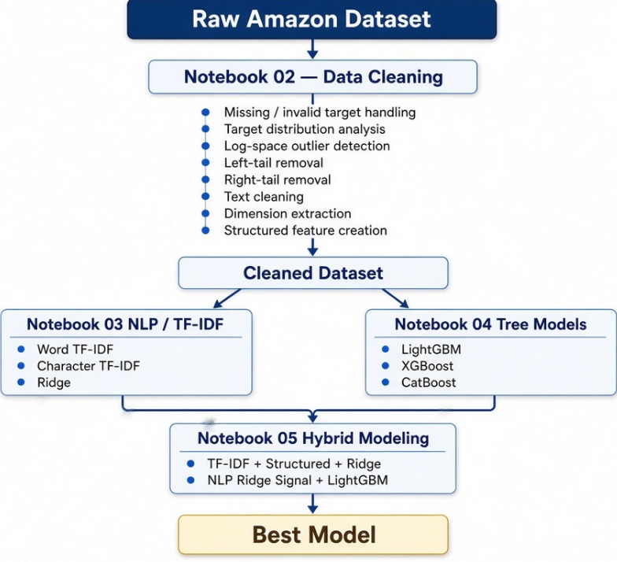

# Amazon ML Challenge 2023 --- Product Length Prediction

An NLP + tabular machine-learning project for predicting
**PRODUCT_LENGTH** from Amazon product metadata.

The project focuses on:

-   Robust target cleaning and outlier handling
-   Product-text preprocessing
-   Word-level TF-IDF
-   Character-level TF-IDF
-   Ridge Regression
-   LightGBM / XGBoost / CatBoost
-   MAPE-driven model selection

> **Current best recorded result: \~49.33% MAPE** on the experiment-mode
> validation setup.

------------------------------------------------------------------------

## 1. Problem Statement

Given Amazon product metadata such as:

-   `PRODUCT_ID`
-   `TITLE`
-   `BULLET_POINTS`
-   `DESCRIPTION`
-   `PRODUCT_TYPE_ID`

predict the product's physical **length** (`PRODUCT_LENGTH`).

The primary evaluation metric used throughout the project is:

$$
MAPE = \frac{100}{n}\sum_{i=1}^{n}
\left|\frac{y_i-\hat{y}_i}{y_i}\right|
$$


## 2. Dataset

The original dataset was approximately:

-   **Train:** 2.2M records \~1.5 GB
-   **Test:** 0.7M records  \~0.5 GB

This dataset is large enough that i decide to developed in multiple modes.
| Mode | Train | Test | Purpose |
| :--- | :---: | :---: | :--- |
| **Debug** | ~50K | ~10K | Fast notebook development and validation |
| **Experiment** | ~200K | ~50K | Larger-scale model experiments |
| **Full competition** | ~2.2M | ~0.7M | Final-scale training |


## 3. Project Pipeline





# 4. Data Cleaning

## Target Transformation

The target distribution is strongly skewed, so the modeling pipeline
uses:

``` python
y_train = np.log1p(PRODUCT_LENGTH)
```

and converts predictions back using:

``` python
prediction = np.expm1(prediction)
```


## Outlier Detection

Outlier boundaries were calculated in log space using the IQR rule:

``` text
Lower Bound = Q1 - multiplier × IQR
Upper Bound = Q3 + multiplier × IQR
```

For the experiment-mode analysis recorded during development:

``` text
log Q1  ≈ 6.2
log Q3  ≈ 6.9
log IQR ≈ 0.7

Lower target boundary ≈ 56.4
Upper target boundary ≈ 9502
```

The resulting tail removal was approximately:

``` text
Left tail  ≈ 2.02%
Right tail ≈ 1.03%
```

This produced an approximately **194K-row cleaned experiment dataset**
from the \~200K experiment subset.

# 5. NLP Feature Engineering

The main text input is constructed from:

``` text
TITLE
+
BULLET_POINTS
+
DESCRIPTION
```


## Word-Level TF-IDF
Word n-grams capture:

-   product categories
-   product names
-   materials
-   descriptive phrases
-   size-related terminology
-   recurring product patterns

Baseline configuration:

``` python
TfidfVectorizer(
    analyzer="word",
    ngram_range=(1, 2),
    sublinear_tf=True
)
```


## Character-Level TF-IDF

Character n-grams capture patterns that word-level tokenization can
miss:

-   measurements
-   model numbers
-   spelling variations
-   SKU-like patterns
-   partial words
-   strings such as `10x20`, `100cm`, `12-inch`

Configuration:

``` python
TfidfVectorizer(
    analyzer="char",
    ngram_range=(3, 5),
    sublinear_tf=True
)
```

# 6. Structured Features

The structured branch contains information extracted during Notebook 02,
including:

### Product metadata

``` text
PRODUCT_TYPE_ID
```

### Dimensions

``` text
DIM_1_CM
DIM_2_CM
DIM_3_CM
DIM_PRODUCT_2D_CM2
DIM_VOLUME_CM3
```

### Dimension indicators

``` text
HAS_DIMENSION_2D
HAS_DIMENSION_3D
```

### Text statistics

``` text
TITLE_CHAR_COUNT
TITLE_WORD_COUNT
TITLE_DIGIT_COUNT
TITLE_EMPTY

BULLET_CHAR_COUNT
BULLET_WORD_COUNT
BULLET_DIGIT_COUNT
BULLET_EMPTY

DESC_CHAR_COUNT
DESC_WORD_COUNT
DESC_DIGIT_COUNT
DESC_EMPTY

HAS_MEASUREMENT_UNIT
```


# 7.Results

## 7.A Debug Mode Results

### NLP Models

| Model | MAPE | MAE | RMSE |
| :--- | :---: | :---: | :---: |
| Ridge + Word TF-IDF | 56.37% | ~467.94 | ~1092.46 |
| Ridge + Character TF-IDF | 56.87% | ~469.64 | ~1083.89 |
| Ridge + Word + Character TF-IDF | **54.57%** | ~451.76 | ~1038.53 |


### Tree Models

| Model | MAPE | MAE | RMSE |
| :--- | :---: | :---: | :---: |
| LightGBM + Structured | **58.22%** | 455.52 | 1009.33 |
| XGBoost + Structured | 58.33% | 457.20 | 1016.87 |
| CatBoost + Structured | 59.78% | 466.13 | 1029.84 |

### Hybrid Models

| Model | MAPE | MAE | RMSE |
| :--- | :---: | :---: | :---: |
| Structured + Ridge + Word TF-IDF | ~56.47% | ~467.71 | ~1085.10 |
| Structured + Ridge + Word + Character TF-IDF | **~54.60%** | ~452.06 | ~1035.65 |
| LightGBM + NLP Ridge Signal | ~54.91% | ~427.22 | ~929.16 |


## 7.B Experiment Mode Results

### NLP Models

| Model | MAPE | MAE | RMSE |
| :--- | :---: | :---: | :---: |
| Ridge + Word TF-IDF | 51.27% | ~412 | ~947 |
| Ridge + Character TF-IDF | ~52.89% | ~421.78 | ~957.86 |
| Ridge + Combined TF-IDF | **50.12%** | ~400.66 | ~943.97 |


### Tree Models

| Model | MAPE | MAE | RMSE |
| :--- | :---: | :---: | :---: |
| LightGBM | ~54.91% | ~413.98 | ~924.99 |
| XGBoost | **~54.66%** | ~416.72 | ~920.20 |
| CatBoost | ~56.88% | ~441.85 | ~943.33 |

### Hybrid Models

| Model | MAPE | MAE | RMSE |
| :--- | :---: | :---: | :---: |
| Structured + Ridge + Word TF-IDF | ~51.32% | ~412.10 | ~942.59 |
| Structured + Ridge + Word + Character TF-IDF | ~50.17% | ~400.25 | ~910.65 |
| LightGBM + NLP Ridge Signal | **~49.33%** | ~376.13 | ~831.11 |

### Best recorded result

``` text
Model:
LightGBM + NLP Ridge Signal

MAPE:
~49.33%
```

This is the current project champion recorded during experimentation.

# 8. Notebook Responsibilities

## Notebook 01 --- EDA

Understand:

-   dataset size
-   missing values
-   target distribution
-   target skew
-   text columns
-   product types
-   extreme values

------------------------------------------------------------------------

## Notebook 02 --- Data Cleaning

Responsible for:

-   validating data
-   removing invalid targets
-   target-tail analysis
-   removing selected left/right target tails
-   text cleaning
-   dimension extraction
-   structured feature creation
-   writing cleaned datasets
-   writing cleaning audit

Outputs:

``` text
dataset/cleaned/
├── train_clean_debug.csv
├── test_clean_debug.csv
├── cleaning_audit_debug.csv
└── cleaning_rules_debug.json
```

------------------------------------------------------------------------

## Notebook 03 --- NLP Baseline

Responsible for:

-   Word TF-IDF
-   Character TF-IDF
-   Combined TF-IDF
-   Ridge Regression
-   MAPE comparison

Key result:

``` text
Debug Word TF-IDF + Ridge
≈ 56.37% MAPE
```

------------------------------------------------------------------------

## Notebook 04 --- Tree Models

Responsible for:

-   structured feature modeling
-   LightGBM
-   XGBoost
-   CatBoost
-   feature importance
-   tree-model comparison

------------------------------------------------------------------------

## Notebook 05 --- Hybrid Modeling

Responsible for:

-   TF-IDF + structured Ridge
-   Word + Character + structured Ridge
-   NLP Ridge prediction as a signal for LightGBM
-   final model comparison

Best recorded result:

``` text
LightGBM + NLP Ridge Signal
≈ 49.33% MAPE
```

------------------------------------------------------------------------

# 9. Key Takeaways

### 1. Data cleaning mattered

The target contained extreme values on both sides of the distribution.
Cleaning the target tails substantially improved the stability of the
modeling pipeline.

### 2. NLP was highly effective

The product text contains useful information for predicting physical
dimensions.

Word-level TF-IDF alone produced a strong baseline.

### 3. Character TF-IDF added complementary information

Character n-grams captured measurements and noisy product-text patterns
that word tokenization could miss.

### 4. Structured features were useful but not sufficient alone

Tree models performed competitively on MAE/RMSE but did not beat the NLP
Ridge model on MAPE in the debug experiments.

### 5. Hybrid modeling produced the strongest result

Combining NLP-derived information with structured features produced the
best recorded experiment result.

------------------------------------------------------------------------

*Made by Ayush Shandilya*
